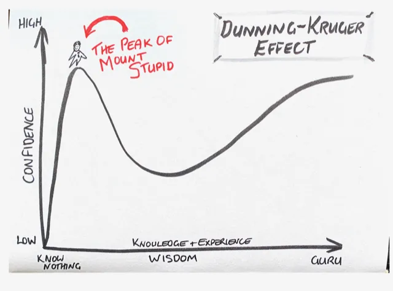

# 🧠 Mount Stupid Bootcamp ⛰️

> A 30-day Python challenge to battle overconfidence, boost logic, and survive the climb from "I know everything" to "I actually know something."

---

## 📉 The Dunning-Kruger Effect

The **Dunning-Kruger effect** is a cognitive bias where people with **low ability at a task overestimate their ability**. In simple terms:  
> **The less you know, the more you *think* you know.**

🔺 At the peak of this curve lies the notorious **Mount Stupid** —  
A place where confidence is high, but knowledge is suspiciously low.

---

## ⛰️ What's Mount Stupid?

Mount Stupid is that deceptive peak where you feel like a Python ninja because you've done a few tutorials and built some projects...

...but when real-world problems show up, you realize:
> "Wait a minute. Do I even *know* Python?"

---

## 🧠 Why This Bootcamp?

I *feel* like I know Python pretty well.  
I’ve done tutorials, solved exercises, even built some things — but deep down, I know there's more to it. This bootcamp is my **reality check** — a 30-day challenge designed to:

- ✅ Test what I really know
- ✅ Improve my problem-solving and logic
- ✅ Simulate real-world scenarios
- ✅ Catch blind spots before they catch me

This is a **personal climb** down from Mount Stupid and up the real **Slope of Enlightenment**.

---

## 🔥 The Rules

- 📆 **Duration**: 30 Days
- ⏱️ **Daily Commitment**: 1 Hour Minimum
- 🧩 **Daily Challenge**: Logic, real-world problems, skill testers
- 🧠 **Goal**: Reach the Plateau of Sustainable Python Brilliance™

---

## 🏁 Join Me?

Feel like you're also camping on Mount Stupid with your overconfidence tent?  
Grab your backpack and climb with me.

> Because *knowing you're not a genius* is the first step to becoming one.
 